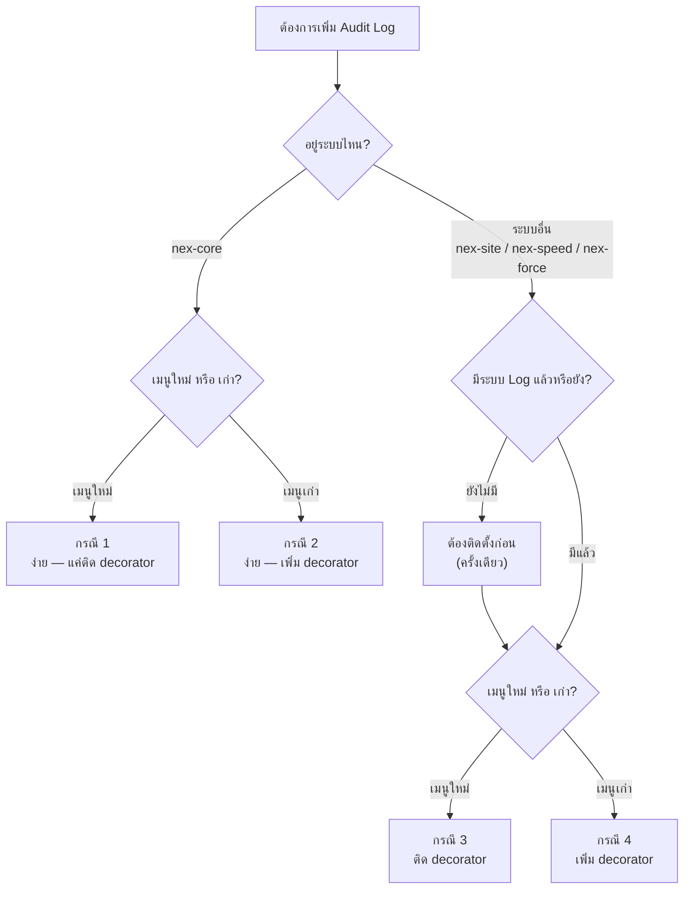

# 📝 คู่มือคำสั่ง — จัดเก็บ Audit Log ทุกสถานการณ์

> รวมคำสั่งสำหรับเพิ่มระบบเก็บ Log ครบ **4 กรณี**  
> ทั้งเมนูใหม่/เมนูเก่า ทั้งใน nex-core และระบบอื่นๆ

---

## แผนผังการตัดสินใจ



---

## กรณี 1: เมนูใหม่ใน nex-core (ง่ายที่สุด ✅)

> ระบบ nex-core มี LoggingInterceptor + AuditLogsModule พร้อมใช้อยู่แล้ว  
> แค่ติด `@AuditLog()` decorator ที่ Controller ก็เก็บ Log อัตโนมัติ

### คำสั่ง:

```
สร้าง CRUD API สำหรับ "[ชื่อเมนู]" ใน nex-core-api พร้อมระบบเก็บ Log

📦 ข้อมูล:
- ชื่อเมนู: [ชื่อเมนู]
- ตาราง DB: nex_core.[ชื่อตาราง]
- ฟิลด์: [รายชื่อ field]
- API Path: /[endpoint]

🔧 สิ่งที่ต้องทำ:
1. สร้าง Entity, Service, Controller, Module
2. ติด @AuditLog('[ชื่อเมนู]', '[Action]') ที่ทุก method ใน Controller
3. Import AuditLog decorator จาก common/decorators/audit-log.decorator
อ้างอิงจาก templates.controller.ts + roles.controller.ts
```

### ตัวอย่าง:

```
สร้าง CRUD API สำหรับ "Products" ใน nex-core-api พร้อมระบบเก็บ Log

📦 ข้อมูล:
- ชื่อเมนู: Products
- ตาราง DB: nex_core.products
- ฟิลด์: product_name, product_desc, price, is_active
- API Path: /products

🔧 สิ่งที่ต้องทำ:
1. สร้าง Entity, Service, Controller, Module
2. ติด @AuditLog('Products', '[Action]') ที่ทุก method
3. Import AuditLog decorator
อ้างอิงจาก templates.controller.ts + roles.controller.ts
```

> [!NOTE]
> **เหตุผลที่ง่าย:** nex-core-api มี `LoggingInterceptor` ลงทะเบียนเป็น Global Interceptor ใน `app.module.ts` แล้ว และ `AuditLogsModule` ก็ถูก import ไว้แล้ว แค่ติด decorator ก็ใช้งานได้ทันที

---

## กรณี 2: เมนูเก่าใน nex-core เพิ่มเก็บ Log (ง่าย ✅)

> สำหรับ Controller ที่มีอยู่แล้วแต่ยังไม่ได้ติด `@AuditLog()`

### คำสั่ง:

```
เพิ่มระบบเก็บ Log ให้เมนู "[ชื่อเมนู]" ใน nex-core-api

📦 ข้อมูล:
- Controller: [ชื่อไฟล์ controller เช่น products.controller.ts]

🔧 สิ่งที่ต้องทำ:
1. import { AuditLog } from '../../common/decorators/audit-log.decorator'
2. ติด @AuditLog('[ชื่อเมนู]', '[Action]') ที่ทุก method:
   - GET /         → @AuditLog('[ชื่อเมนู]', 'Find All')
   - GET /:id      → @AuditLog('[ชื่อเมนู]', 'Find One')
   - POST /        → @AuditLog('[ชื่อเมนู]', 'Create')
   - PATCH /:id    → @AuditLog('[ชื่อเมนู]', 'Update')
   - DELETE /:id   → @AuditLog('[ชื่อเมนู]', 'Remove')
   - (อื่นๆ ถ้ามี)
อ้างอิงจาก roles.controller.ts
```

### ตัวอย่าง:

```
เพิ่มระบบเก็บ Log ให้เมนู "Notifications" ใน nex-core-api

📦 ข้อมูล:
- Controller: notifications.controller.ts

🔧 สิ่งที่ต้องทำ:
1. import AuditLog decorator
2. ติด @AuditLog('Notifications', '[Action]') ที่ทุก method
อ้างอิงจาก roles.controller.ts
```

> [!TIP]
> **สถานะปัจจุบัน:** nex-core-api ติด `@AuditLog` ครบทุก Controller แล้ว กรณีนี้จะใช้เมื่อเพิ่ม Controller ใหม่ในอนาคต

---

## กรณี 3: เมนูใหม่ในระบบอื่น (nex-site / nex-speed / nex-force)

> ระบบอื่นๆ ยังไม่มี Audit Log ต้อง **ติดตั้งโครงสร้างพื้นฐานก่อน (ครั้งเดียว)**  
> แล้วค่อยติด decorator ที่ Controller

### คำสั่งขั้นที่ 1 — ติดตั้งระบบ Log (ทำครั้งเดียวต่อ API)

#### สำหรับ nex-site-api (NestJS):

```
ติดตั้งระบบ Audit Log ให้ nex-site-api ทั้งระบบ

🔧 สิ่งที่ต้องทำ (ครั้งเดียว):
1. Copy ไฟล์จาก nex-core-api ไปยัง nex-site-api:
   - src/common/decorators/audit-log.decorator.ts
   - src/common/interceptors/logging.interceptor.ts
   - src/master-data/audit-logs/audit-logs.module.ts
   - src/master-data/audit-logs/audit-logs.service.ts
   - src/master-data/audit-logs/entities/audit-log.entity.ts

2. แก้ไข app.module.ts ของ nex-site-api:
   - import AuditLogsModule
   - ลงทะเบียน LoggingInterceptor เป็น Global Interceptor:
     providers: [{ provide: APP_INTERCEPTOR, useClass: LoggingInterceptor }]

3. ใช้ตาราง nex_core.audit_logs ร่วมกัน (schema เดียวกัน)

อ้างอิงโครงสร้าง app.module.ts จาก nex-core-api
```

#### สำหรับ nex-speed-api (Go):

```
ติดตั้งระบบ Audit Log ให้ nex-speed-api (Go)

🔧 สิ่งที่ต้องทำ (ครั้งเดียว):
1. สร้าง middleware/audit_log.go:
   - ดักจับ request ที่ match กับ route ที่กำหนด
   - เก็บข้อมูล 5W1H (WHO, WHAT, WHEN, WHERE, HOW, WHY)
   - INSERT INTO nex_core.audit_logs

2. สร้าง models/audit_log.go:
   - struct AuditLog ตรงกับตาราง nex_core.audit_logs

3. ลงทะเบียน middleware ใน router/router.go

4. สร้าง config ให้ระบุ route + module name ที่ต้องการเก็บ log

อ้างอิง schema จาก nex-core-api/src/master-data/audit-logs/entities/audit-log.entity.ts
```

#### สำหรับ nex-force-api (.NET/Node.js):

```
ติดตั้งระบบ Audit Log ให้ nex-force-api

🔧 สิ่งที่ต้องทำ (ครั้งเดียว):
- ตัดสินใจ: เก็บ log ที่ Gateway รวม หรือ แต่ละ Service แยก?
- สร้าง Middleware / Filter ที่ดักจับ request
- เขียนลงตาราง nex_core.audit_logs (schema เดียวกัน)

อ้างอิง schema จาก nex-core-api
```

### คำสั่งขั้นที่ 2 — ติด Log ที่ Controller ใหม่

```
สร้าง CRUD API สำหรับ "[ชื่อเมนู]" ใน [ชื่อ API เช่น nex-site-api] พร้อมเก็บ Log

📦 ข้อมูล:
- ชื่อเมนู: [ชื่อเมนู]
- ตาราง DB: [schema.table]
- ฟิลด์: [รายชื่อ field]
- API Path: /[endpoint]

🔧 สิ่งที่ต้องทำ:
1. สร้าง Entity, Service, Controller, Module
2. ติด @AuditLog('[ชื่อเมนู]', '[Action]') ที่ทุก method
อ้างอิงจาก nex-core-api/templates.controller.ts
```

---

## กรณี 4: เมนูเก่าในระบบอื่น เพิ่มเก็บ Log

> ถ้าระบบนั้นยังไม่มี Audit Log → ต้องทำขั้นที่ 1 ก่อน (กรณี 3)  
> ถ้าติดตั้งแล้ว → ทำแค่ติด decorator

### คำสั่ง (หลังติดตั้งระบบแล้ว):

```
เพิ่มระบบเก็บ Log ให้ Controller ที่มีอยู่ทั้งหมดใน [ชื่อ API เช่น nex-site-api]

🔧 สิ่งที่ต้องทำ:
1. import AuditLog decorator ในทุก Controller
2. ติด @AuditLog('[Module]', '[Action]') ที่ทุก method ของทุก Controller:
   - auth.controller.ts → @AuditLog('Auth', 'Login'), @AuditLog('Auth', 'Register')
   - company.controller.ts → @AuditLog('Company', 'Find All'), ...
   - contact.controller.ts → @AuditLog('Contact', 'Find All'), ...
   - (ทุก controller ที่เหลือ)
อ้างอิงจาก nex-core-api/roles.controller.ts
```

### หรือถ้าต้องการเพิ่มแค่บาง Controller:

```
เพิ่มระบบเก็บ Log ให้ [ชื่อ controller] ใน [ชื่อ API]

📦 ข้อมูล:
- Controller: [ชื่อไฟล์]
- Module Name: [ชื่อ module สำหรับ log]

🔧 สิ่งที่ต้องทำ:
1. import AuditLog decorator
2. ติด @AuditLog('[Module]', '[Action]') ที่ทุก method
อ้างอิงจาก nex-core-api/roles.controller.ts
```

---

## ตารางสรุปทุกกรณี

| กรณี | ระบบ | เมนู | ความยาก | สั่งว่า |
|:---:|---|---|:---:|---|
| **1** | nex-core | ใหม่ | ง่าย | `สร้าง CRUD API สำหรับ "[ชื่อ]" ใน nex-core-api พร้อมเก็บ Log` |
| **2** | nex-core | เก่า | ง่าย | `เพิ่มระบบเก็บ Log ให้ [controller] ใน nex-core-api` |
| **3** | ระบบอื่น | ใหม่ | ปานกลาง | ขั้น 1: `ติดตั้งระบบ Audit Log ให้ [API]` → ขั้น 2: `ติด @AuditLog ที่ Controller` |
| **4** | ระบบอื่น | เก่า | ปานกลาง | (ถ้ายังไม่ติดตั้ง → ทำขั้น 1 ก่อน) → `เพิ่ม @AuditLog ให้ [controller] ทุก method` |

---

## สถานะการติดตั้ง Audit Log ในแต่ละระบบ

| ระบบ | ภาษา | LoggingInterceptor | AuditLogsModule | @AuditLog ทุก Controller |
|---|---|:---:|:---:|:---:|
| **nex-core-api** | NestJS | ✅ พร้อม | ✅ พร้อม | ✅ ครบแล้ว |
| **nex-site-api** | NestJS | ❌ ยังไม่มี | ❌ ยังไม่มี | ❌ ยังไม่มี |
| **nex-speed-api** | Go | ❌ ยังไม่มี | ❌ ยังไม่มี | ❌ ยังไม่มี |
| **nex-force-api** | .NET + Node.js | ❌ ยังไม่มี | ❌ ยังไม่มี | ❌ ยังไม่มี |

> [!WARNING]
> สำหรับระบบที่ยังไม่มี (❌) ต้อง **ติดตั้งโครงสร้างพื้นฐานก่อน** (กรณี 3 ขั้นที่ 1) จึงจะเริ่มเก็บ Log ได้

> [!IMPORTANT]
> ทุกระบบใช้ **ตาราง `nex_core.audit_logs` เดียวกัน** ดังนั้น Log จากทุก API จะรวมอยู่ในที่เดียว แสดงผลผ่านหน้า Activity Logs ของ nex-core ได้ทั้งหมด
