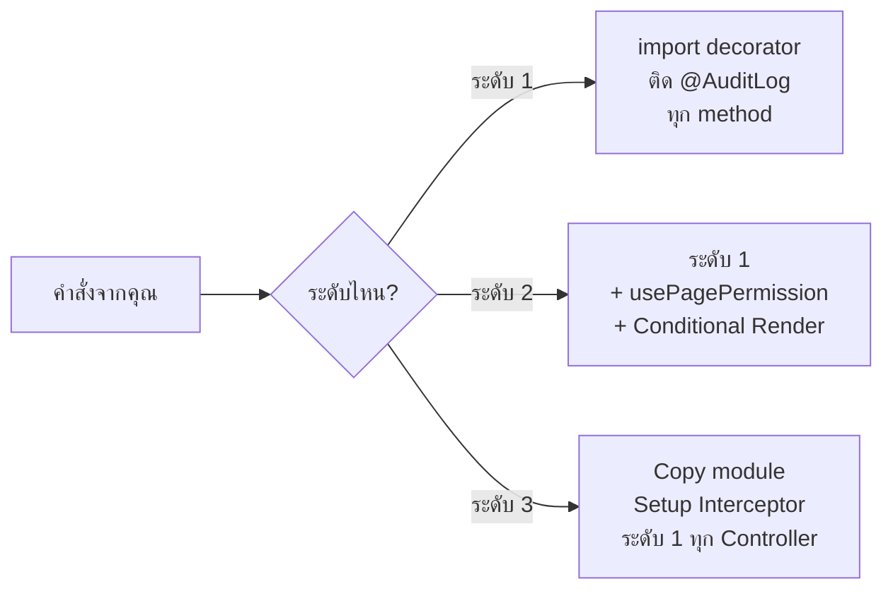

# 🗣️ คู่มือคำสั่ง — เพิ่ม Audit Log ให้เมนูใหม่

> เอกสารนี้รวบรวม **ตัวอย่างคำสั่ง (Prompt)** ที่คุณสามารถ Copy-Paste ไปใช้ได้เลย  
> เมื่อสร้างเมนูใหม่แล้วต้องการให้ AI เพิ่มระบบเก็บ Log อัตโนมัติ

---

## ระดับ 1: เพิ่ม Audit Log ที่ Backend อย่างเดียว (ง่ายสุด)

### คำสั่ง:

```
เพิ่ม @AuditLog decorator ให้ทุก method ใน [ชื่อ controller]
โดยอ้างอิงรูปแบบจาก roles.controller.ts ใน nex-core-api
```

### ตัวอย่าง:

```
เพิ่ม @AuditLog decorator ให้ทุก method ใน products.controller.ts 
โดยอ้างอิงรูปแบบจาก roles.controller.ts ใน nex-core-api
```

> [!NOTE]
> ใช้กรณี: Controller ใหม่อยู่ใน `nex-core-api` ที่ติดตั้ง LoggingInterceptor แล้ว  
> AI จะ import decorator แล้วติด `@AuditLog('ModuleName', 'Action')` ที่ทุก method ให้

---

## ระดับ 2: เพิ่มทั้ง Audit Log + Permission ที่ Frontend

### คำสั่ง:

```
เพิ่ม Audit Log ให้เมนู [ชื่อเมนู] ทั้ง Backend และ Frontend
- Backend: ติด @AuditLog decorator ที่ [ชื่อ controller] ทุก method
- Frontend: ใช้ usePagePermission('[ชื่อเมนู]') กำหนดสิทธิ์
  - ช่องค้นหา ผูกกับ canView
  - ปุ่ม Export ผูกกับ canExport 
  - คอลัมน์จัดการ ผูกกับ canView
อ้างอิงรูปแบบจาก ActivityLogs.tsx และ roles.controller.ts
```

### ตัวอย่าง:

```
เพิ่ม Audit Log ให้เมนู Products ทั้ง Backend และ Frontend
- Backend: ติด @AuditLog decorator ที่ products.controller.ts ทุก method
- Frontend: ใช้ usePagePermission('Products') กำหนดสิทธิ์
  - ช่องค้นหา ผูกกับ canView
  - ปุ่ม Export ผูกกับ canExport
  - คอลัมน์จัดการ ผูกกับ canView
  - ปุ่มเพิ่ม ผูกกับ canAdd
  - ปุ่มแก้ไข ผูกกับ canEdit
  - ปุ่มลบ ผูกกับ canDelete
อ้างอิงรูปแบบจาก ActivityLogs.tsx และ roles.controller.ts
```

---

## ระดับ 3: เพิ่ม Audit Log ให้ API อื่นที่ยังไม่มีระบบ Log

### คำสั่ง (สำหรับ nex-site-api):

```
เพิ่มระบบ Audit Log ให้ nex-site-api ทั้งระบบ
1. Copy โมดูล audit-logs, decorator, interceptor จาก nex-core-api
2. ลงทะเบียน LoggingInterceptor เป็น Global Interceptor ใน app.module.ts
3. ติด @AuditLog decorator ให้ทุก Controller ทุก method
4. ใช้ตาราง nex_core.audit_logs ร่วมกับ nex-core-api
อ้างอิงโครงสร้างจาก nex-core-api
```

---

## ตารางสรุปคำสั่งลัด

| ต้องการ | คำสั่งสั้น |
|---|---|
| ติด Log ที่ Controller ตัวเดียว | `เพิ่ม @AuditLog ให้ [controller] ทุก method` |
| ติด Log + Permission ที่ Frontend | `เพิ่ม Audit Log ให้เมนู [ชื่อ] ทั้ง Backend และ Frontend` |
| ติดตั้งระบบ Log ให้ API ใหม่ | `เพิ่มระบบ Audit Log ให้ [ชื่อ api] ทั้งระบบ` |
| ดูสถานะ Log ปัจจุบัน | `สรุปสถานะ Audit Log ของทุก Controller` |

---

## สิ่งที่ AI จะทำให้อัตโนมัติเมื่อได้รับคำสั่ง



> [!TIP]
> **คำแนะนำ:** ในกรณีส่วนใหญ่ ใช้แค่ **ระดับ 1** ก็เพียงพอ เพราะ `nex-core-api` ติดตั้ง LoggingInterceptor ไว้แล้ว แค่ติด decorator ก็ใช้งานได้ทันที
