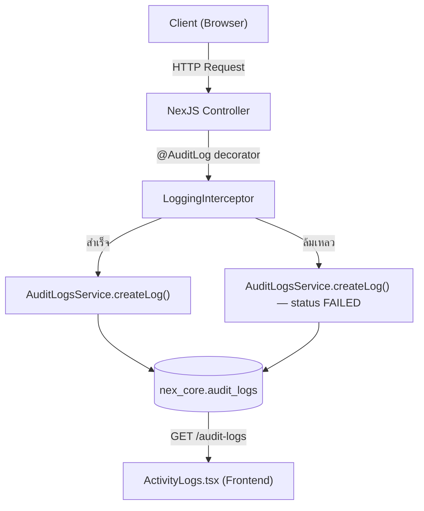

# 📋 สรุประบบ Audit Logging — NexOne Platform

---

## 1. สถาปัตยกรรมภาพรวม (Architecture)



ระบบเก็บ Log ทำงานแบบ **อัตโนมัติผ่าน Interceptor** โดยไม่ต้องเขียนโค้ดบันทึกเองในแต่ละ Service

---

## 2. ขั้นตอนการทำงาน (Flow)

| ลำดับ | ขั้นตอน | รายละเอียด |
|:---:|---|---|
| 1 | **Client ส่ง Request** | ผู้ใช้กดปุ่มในหน้าเว็บ → เรียก API endpoint |
| 2 | **Controller รับ Request** | NestJS Controller ที่ติด `@AuditLog('Module', 'Action')` |
| 3 | **LoggingInterceptor ดักจับ** | ตรวจสอบว่า method มี metadata `audit_log` หรือไม่ |
| 4 | **ดำเนินงาน** | ส่ง request ต่อไปยัง Service ตามปกติ |
| 5 | **บันทึกผลลัพธ์** | สำเร็จ → status `SUCCESS` / ล้มเหลว → status `FAILED` + error_message |
| 6 | **เก็บลง Database** | บันทึกลงตาราง `nex_core.audit_logs` |

---

## 3. เงื่อนไขการเก็บ Log

### ✅ จะเก็บ Log ก็ต่อเมื่อ:
- Controller method มี decorator `@AuditLog('ModuleName', 'ActionName')` ติดอยู่
- `LoggingInterceptor` ถูกลงทะเบียนเป็น Global Interceptor ใน `AppModule`

### ❌ จะไม่เก็บ Log ถ้า:
- Method ไม่มี `@AuditLog()` decorator → Interceptor จะข้ามไปเลย
- API service นั้นไม่ได้ import `AuditLogsModule` หรือไม่ได้ register `LoggingInterceptor`

---

## 4. ข้อมูลที่เก็บ (5W1H Model)

| หมวด | คอลัมน์ | ที่มาของข้อมูล |
|---|---|---|
| **WHAT** (ทำอะไร) | `action`, `title`, `description`, `module` | จาก `@AuditLog(module, action)` decorator |
| **WHO** (ใครทำ) | `user_id`, `user_name`, `role_name` | จาก `req.user` (JWT token) |
| **WHEN** (เมื่อไหร่) | `created_at` | Auto-generate จาก Database |
| **WHERE** (ที่ไหน) | `ip_address`, `endpoint`, `user_agent` | จาก HTTP Request headers |
| **HOW** (อย่างไร) | `payload`, `response_time_ms` | จาก Request body + คำนวณเวลา |
| **WHY** (ผลลัพธ์) | `status`, `error_message` | `SUCCESS` หรือ `FAILED` + error message |

---

## 5. ไฟล์หลักที่เกี่ยวข้อง

| ไฟล์ | หน้าที่ |
|---|---|
| [audit-log.decorator.ts](file:///c:/Task/NexOne/services/nex-core-api/src/common/decorators/audit-log.decorator.ts) | Decorator สำหรับติดที่ Controller method |
| [logging.interceptor.ts](file:///c:/Task/NexOne/services/nex-core-api/src/common/interceptors/logging.interceptor.ts) | Interceptor ที่ดักจับ request/response แล้วบันทึก log |
| [audit-log.entity.ts](file:///c:/Task/NexOne/services/nex-core-api/src/master-data/audit-logs/entities/audit-log.entity.ts) | Entity (โครงสร้างตาราง) `nex_core.audit_logs` |
| [audit-logs.service.ts](file:///c:/Task/NexOne/services/nex-core-api/src/master-data/audit-logs/audit-logs.service.ts) | Service สำหรับ createLog / getAllLogs / getRecentLogs |
| [audit-logs.module.ts](file:///c:/Task/NexOne/services/nex-core-api/src/master-data/audit-logs/audit-logs.module.ts) | Module ที่ export `AuditLogsService` ให้ Interceptor ใช้ |
| [app.module.ts](file:///c:/Task/NexOne/services/nex-core-api/src/app.module.ts) | ลงทะเบียน `LoggingInterceptor` เป็น Global Interceptor |
| [ActivityLogs.tsx](file:///c:/Task/NexOne/apps/nex-core-admin/src/components/ActivityLogs.tsx) | หน้า Frontend แสดงผล Activity Logs + Permission Control |

---

## 6. สถานะปัจจุบัน — nex-core-api (✅ ติดแล้วทุก Controller)

| Controller | Module Name | Actions ที่บันทึก | สถานะ |
|---|---|---|:---:|
| `app.controller.ts` | App | Get Hello | ✅ |
| `company.controller.ts` | Company | * | ✅ |
| `email-templates.controller.ts` | Email Templates | * | ✅ |
| `audit-logs.controller.ts` | Audit Logs | Get All Logs, Get Recent Logs | ✅ |
| `notifications.controller.ts` | Notifications | * | ✅ |
| `provinces.controller.ts` | Provinces | * | ✅ |
| `roles.controller.ts` | Roles | Find All, Find One, Create, Update, Remove + Save/Get Permissions | ✅ |
| `system-apps.controller.ts` | System Apps | Find All, Create, Update, Remove | ✅ |
| `template-master-graph.controller.ts` | Template Master Graph | Find All, Get Summary, Find One, Create, Update, Toggle Status, Remove | ✅ |
| `themes.controller.ts` | Themes | Get Active Theme, Update Theme | ✅ |
| `unit-types.controller.ts` | Unit Types | Find All, Find One, Create, Update, Remove | ✅ |
| `menus.controller.ts` | Menus | Create, Find All, Find One, Update, Remove, Toggle Status | ✅ |
| `templates.controller.ts` | Templates | Find All, Find One, Create, Update, Remove, Toggle Status | ✅ |
| `translations.controller.ts` | Translations | Get Languages, Create Language, Update, Delete, Bulk Update, ฯลฯ (15 actions) | ✅ |

> [!TIP]
> **สรุป: `nex-core-api` ครบทุก Controller แล้ว ไม่ต้องแก้อะไรเพิ่ม**

---

## 7. แอปอื่นๆ ในระบบ — ต้องแก้อะไร?

### 7.1 nex-site-api (NestJS) ❌ ยังไม่มีระบบ Log

| รายการ | สถานะ | สิ่งที่ต้องทำ |
|---|:---:|---|
| `AuditLogsModule` | ❌ ไม่มี | ต้อง import module หรือเชื่อม shared database |
| `LoggingInterceptor` | ❌ ไม่มี | ต้องลงทะเบียน Global Interceptor |
| `@AuditLog()` decorator | ❌ ไม่มี | ต้องติด decorator ที่ทุก controller method |

**Controllers ที่ต้องติด (14 ตัว):**
- `auth.controller.ts` — Login, Register, Logout
- `company.controller.ts` — CRUD Company
- `contact.controller.ts` — CRUD Contact
- `email-templates.controller.ts` — CRUD Email Templates
- `jobs.controller.ts` — CRUD Jobs
- `menus.controller.ts` — CRUD Menus
- `pages.controller.ts` — CRUD Pages
- `provinces.controller.ts` — CRUD Provinces
- `roles.controller.ts` — CRUD Roles
- `site-settings.controller.ts` — CRUD Site Settings
- `system-app.controller.ts` — CRUD System Apps
- `theme.controller.ts` — CRUD Themes
- `translations.controller.ts` — CRUD Translations
- `unit-types.controller.ts` — CRUD Unit Types

### 7.2 nex-speed-api (Go/Golang) ⚠️ ต่างภาษา

| รายการ | สถานะ | สิ่งที่ต้องทำ |
|---|:---:|---|
| Audit Logging | ❌ ไม่มี | ต้องเขียน Middleware ใน Go เทียบเท่ากับ LoggingInterceptor |
| เขียนลง DB | ❌ ไม่มี | ต้องเขียน SQL INSERT เข้าตาราง `nex_core.audit_logs` โดยตรง |

> [!WARNING]
> `nex-speed-api` เขียนด้วย **Go** ไม่ใช่ NestJS ดังนั้นต้องเขียน **Middleware** ใหม่ใน Go ที่ทำหน้าที่เดียวกับ LoggingInterceptor

### 7.3 nex-force-api (.NET / Node.js Mix) ⚠️ Microservices

| รายการ | สถานะ | สิ่งที่ต้องทำ |
|---|:---:|---|
| Audit Logging | ❌ ไม่มี | ต้องเพิ่ม logging middleware ในแต่ละ service |
| หลาย service (Gateway, HrService, Attendance, Auth, Performance, solutionAPI) | ❌ | ต้องตัดสินใจว่าจะบันทึก log ที่ระดับ Gateway หรือแต่ละ Service |

---

## 8. วิธีเพิ่ม Audit Log ให้เมนูใหม่ (Step-by-Step)

### สำหรับ nex-core-api (NestJS) — ง่ายที่สุด

```typescript
// ขั้นตอนที่ 1: Import decorator ในไฟล์ Controller
import { AuditLog } from '../../common/decorators/audit-log.decorator';

// ขั้นตอนที่ 2: ติด @AuditLog() ที่แต่ละ method
@Get()
@AuditLog('ชื่อโมดูล', 'ชื่อ Action')
findAll() {
  return this.service.findAll();
}

@Post()
@AuditLog('ชื่อโมดูล', 'Create')
create(@Body() dto: CreateDto) {
  return this.service.create(dto);
}
```

> [!NOTE]
> แค่ติด decorator เท่านั้น ไม่ต้องเขียนโค้ดบันทึก log เองเลย เพราะ `LoggingInterceptor` จะจัดการให้อัตโนมัติ

### สำหรับ nex-site-api (NestJS) — ต้องเซ็ตอัพก่อน

```
ขั้นตอนที่ 1: Copy ไฟล์ต่อไปนี้ไปยัง nex-site-api
├── src/common/decorators/audit-log.decorator.ts
├── src/common/interceptors/logging.interceptor.ts
├── src/master-data/audit-logs/
│   ├── audit-logs.module.ts
│   ├── audit-logs.service.ts
│   └── entities/audit-log.entity.ts

ขั้นตอนที่ 2: Import AuditLogsModule ใน app.module.ts

ขั้นตอนที่ 3: ลงทะเบียน LoggingInterceptor เป็น Global Interceptor
providers: [
  { provide: APP_INTERCEPTOR, useClass: LoggingInterceptor }
]

ขั้นตอนที่ 4: ติด @AuditLog() ที่แต่ละ Controller method
```

### สำหรับ nex-speed-api (Go) — ต้องเขียน Middleware ใหม่

```
ขั้นตอนที่ 1: สร้าง middleware/audit.go
ขั้นตอนที่ 2: ดักจับ request/response ใน middleware
ขั้นตอนที่ 3: INSERT INTO nex_core.audit_logs (...) VALUES (...)
ขั้นตอนที่ 4: ลงทะเบียน middleware ใน router
```

---

## 9. Frontend — สิทธิ์การเข้าถึงหน้า Activity Logs

| UI Element | ผูกกับสิทธิ์ | สถานะ |
|---|---|:---:|
| ช่องค้นหา (Search Box) | `perm.canView` | ✅ |
| ปุ่ม Export (XLSX/CSV/PDF) | `perm.canExport` | ✅ |
| คอลัมน์ "จัดการ" (Actions) | `perm.canView` | ✅ |
| ปุ่ม "ดูรายละเอียด" (Eye Icon) | `perm.canView` | ✅ |
| ตัวกรองโมดูล (Module Filter) | ไม่มีเงื่อนไข (แสดงเสมอ) | ✅ |

---

## 10. สรุปสิ่งที่ต้องทำ (Action Items)

| ลำดับ | งาน | ความสำคัญ | ความยาก |
|:---:|---|:---:|:---:|
| 1 | ✅ `nex-core-api` — ครบแล้วทุก Controller | — | — |
| 2 | ✅ Frontend Permission — ครบแล้ว | — | — |
| 3 | 🔴 `nex-site-api` — เพิ่ม Audit Logging (Copy + Paste จาก core) | สูง | ง่าย |
| 4 | 🟡 `nex-speed-api` — เขียน Go Middleware สำหรับ Audit Log | ปานกลาง | ปานกลาง |
| 5 | 🟡 `nex-force-api` — เพิ่ม Logging ที่ Gateway หรือแต่ละ Service | ปานกลาง | ยาก |

> [!IMPORTANT]
> **สำหรับ nex-core-admin ไม่ต้องแก้ไขอะไรเพิ่มแล้ว** ทั้ง Backend (ทุก Controller ติด @AuditLog แล้ว) และ Frontend (Permission ครบแล้ว) ส่วนที่เหลือเป็นงานขยายไปยัง API service อื่นๆ
