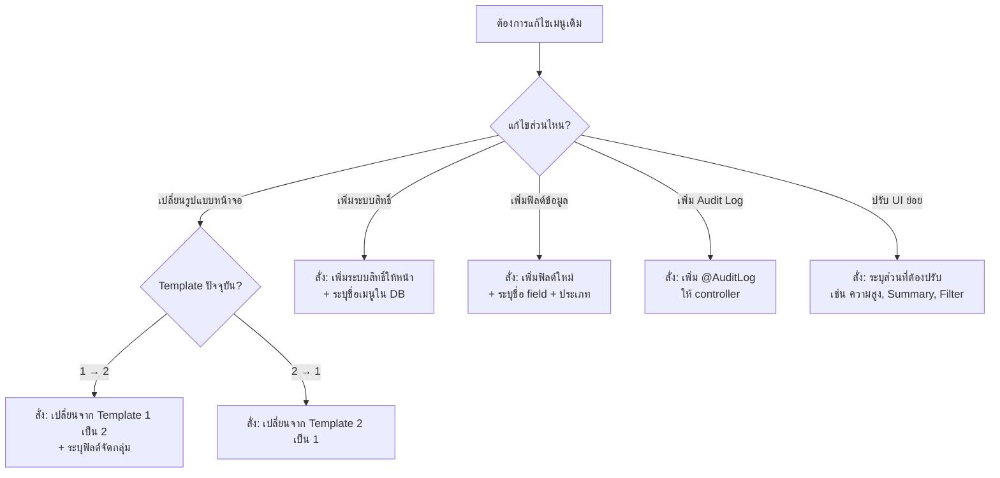

# 🔄 คู่มือคำสั่ง — แก้ไขเมนูเดิม / เปลี่ยน Template

> เอกสารนี้รวบรวม **คำสั่งสำหรับปรับปรุงเมนูที่มีอยู่แล้ว**  
> เช่น เปลี่ยนรูปแบบหน้าจอ, เพิ่มสิทธิ์, เพิ่มฟิลด์, เพิ่ม Audit Log

---

## 📑 สารบัญ

1. [เปลี่ยน Template (1→2 หรือ 2→1)](#1-เปลี่ยน-template)
2. [เพิ่ม Permission ให้เมนูเดิมที่ยังไม่มี](#2-เพิ่ม-permission)
3. [เพิ่มฟิลด์/คอลัมน์ใหม่ให้เมนูเดิม](#3-เพิ่มฟิลด์ใหม่)
4. [เพิ่ม Audit Log ให้เมนูเดิม](#4-เพิ่ม-audit-log)
5. [ปรับ UI เฉพาะส่วน](#5-ปรับ-ui-เฉพาะส่วน)
6. [ตารางสรุปคำสั่งลัด](#6-ตารางสรุป)

---

## 1. เปลี่ยน Template

### 1.1 เปลี่ยนจาก Template 1 → Template 2 (เพิ่ม Summary Cards)

```
เปลี่ยนหน้า "[ชื่อเมนู]" จาก Template 1 เป็น Template 2

📦 รายละเอียด:
- ไฟล์ปัจจุบัน: [ชื่อไฟล์ component เช่น ProductsPage.tsx]
- ฟิลด์จัดกลุ่ม: [ฟิลด์ที่จะใช้ทำ Summary Card เช่น category, type]

🔧 สิ่งที่ต้องเพิ่ม:
- เพิ่ม Summary Cards ด้านบน (กรองตาม [ฟิลด์จัดกลุ่ม])
- เพิ่ม Modal เพิ่มหมวดหมู่ใหม่
- คงสิทธิ์ Permission เดิมไว้ทั้งหมด
- คงโครงสร้าง CRUD, Pagination เดิมไว้
อ้างอิงรูปแบบจาก TemplateMaster2Page.tsx
```

#### ตัวอย่าง:

```
เปลี่ยนหน้า "Products" จาก Template 1 เป็น Template 2

📦 รายละเอียด:
- ไฟล์ปัจจุบัน: ProductsPage.tsx
- ฟิลด์จัดกลุ่ม: product_category

🔧 สิ่งที่ต้องเพิ่ม:
- เพิ่ม Summary Cards ด้านบน (กรองตาม product_category)
- เพิ่ม Modal เพิ่มหมวดหมู่ใหม่
- คงสิทธิ์ Permission เดิมไว้ทั้งหมด
อ้างอิงรูปแบบจาก TemplateMaster2Page.tsx
```

---

### 1.2 เปลี่ยนจาก Template 2 → Template 1 (ลด Summary Cards)

```
เปลี่ยนหน้า "[ชื่อเมนู]" จาก Template 2 เป็น Template 1

📦 รายละเอียด:
- ไฟล์ปัจจุบัน: [ชื่อไฟล์ component]

🔧 สิ่งที่ต้องทำ:
- ลบ Summary Cards ออก
- ลบตัวกรองหมวดหมู่ออก
- ลบ Modal เพิ่มหมวดหมู่ออก
- คงสิทธิ์ Permission เดิมไว้ทั้งหมด
- คงโครงสร้าง CRUD, Pagination เดิมไว้
อ้างอิงรูปแบบจาก TemplateMaster1Page.tsx
```

---

## 2. เพิ่ม Permission ให้เมนูเดิมที่ยังไม่มี

```
เพิ่มระบบสิทธิ์ (Permission) ให้หน้า "[ชื่อเมนู]"

📦 รายละเอียด:
- ไฟล์: [ชื่อไฟล์ component เช่น ProductsPage.tsx]
- ชื่อเมนูใน DB: [ชื่อที่ตรงกับ nex_core.menus.title]

🔧 สิ่งที่ต้องทำ:
- import usePagePermission จาก PermissionContext
- เรียก const perm = usePagePermission('[ชื่อเมนู]')
- ผูกสิทธิ์ทุกปุ่มตาม pattern มาตรฐาน:
  • ปุ่ม Export (XLSX/CSV/PDF) → perm.canExport
  • ช่องค้นหา → perm.canView
  • ปุ่มเพิ่มข้อมูล → perm.canAdd
  • ปุ่มดูรายละเอียด (Eye) → perm.canView
  • ปุ่มแก้ไข (Edit) → perm.canEdit
  • ปุ่มลบ (Delete) → perm.canDelete
  • StatusDropdown → disabled={!perm.canEdit}
  • คอลัมน์จัดการทั้งคอลัมน์ → ซ่อนถ้าไม่มีสิทธิ์ใดเลย
อ้างอิงรูปแบบจาก TemplateMaster1Page.tsx
```

#### ตัวอย่าง:

```
เพิ่มระบบสิทธิ์ (Permission) ให้หน้า "Email Templates"

📦 รายละเอียด:
- ไฟล์: EmailTemplatesPage.tsx
- ชื่อเมนูใน DB: Email Templates

🔧 สิ่งที่ต้องทำ:
- ผูกสิทธิ์ทุกปุ่มตาม pattern มาตรฐาน
อ้างอิงรูปแบบจาก TemplateMaster1Page.tsx
```

---

## 3. เพิ่มฟิลด์ใหม่ให้เมนูเดิม

```
เพิ่มฟิลด์ใหม่ให้เมนู "[ชื่อเมนู]" ทั้ง Backend และ Frontend

📦 ฟิลด์ที่ต้องเพิ่ม:
- [ชื่อฟิลด์ 1]: [ประเภท เช่น VARCHAR(100)] — [คำอธิบาย]
- [ชื่อฟิลด์ 2]: [ประเภท] — [คำอธิบาย]

🔧 สิ่งที่ต้องทำ:
1. Database: ALTER TABLE เพิ่มคอลัมน์
2. Backend: อัพเดท Entity เพิ่ม field ใหม่
3. Frontend: เพิ่มคอลัมน์ในตาราง + ฟอร์มใน Modal
4. Frontend: เพิ่มใน Export columns
```

#### ตัวอย่าง:

```
เพิ่มฟิลด์ใหม่ให้เมนู "Products" ทั้ง Backend และ Frontend

📦 ฟิลด์ที่ต้องเพิ่ม:
- sku: VARCHAR(50) — รหัสสินค้า
- weight: DECIMAL(10,2) — น้ำหนัก (กก.)

🔧 สิ่งที่ต้องทำ:
1. Database: ALTER TABLE nex_core.products ADD COLUMN
2. Backend: อัพเดท Entity เพิ่ม field ใหม่
3. Frontend: เพิ่มคอลัมน์ในตาราง + ฟอร์มใน Modal
4. Frontend: เพิ่มใน Export columns
```

---

## 4. เพิ่ม Audit Log ให้เมนูเดิม

```
เพิ่ม @AuditLog decorator ให้ [ชื่อ controller] ทุก method
อ้างอิงรูปแบบจาก roles.controller.ts ใน nex-core-api
```

---

## 5. ปรับ UI เฉพาะส่วน

### 5.1 ปรับความสูงตาราง

```
ปรับความสูงตารางของหน้า "[ชื่อเมนู]" เป็น [จำนวน]px
```

### 5.2 เพิ่ม/เปลี่ยน Summary Cards

```
เพิ่ม Summary Cards ให้หน้า "[ชื่อเมนู]" 
กรองตามฟิลด์ [ชื่อฟิลด์]
อ้างอิงจาก TemplateMaster2Page.tsx
```

### 5.3 ปรับ Pagination

```
ปรับ Pagination ของหน้า "[ชื่อเมนู]" ให้เป็นแบบปุ่มตัวเลข
อ้างอิงจาก Pagination component
```

### 5.4 เพิ่มตัวกรอง (Filter)

```
เพิ่มตัวกรองด้วย Dropdown ให้หน้า "[ชื่อเมนู]"
กรองตามฟิลด์ [ชื่อฟิลด์]
อ้างอิงจาก ActivityLogs.tsx (module filter)
```

---

## 6. ตารางสรุปคำสั่งลัด

| ต้องการ | คำสั่ง |
|---|---|
| เปลี่ยน Template 1→2 | `เปลี่ยนหน้า "[ชื่อ]" จาก Template 1 เป็น Template 2 ฟิลด์จัดกลุ่ม: [field]` |
| เปลี่ยน Template 2→1 | `เปลี่ยนหน้า "[ชื่อ]" จาก Template 2 เป็น Template 1` |
| เพิ่ม Permission | `เพิ่มระบบสิทธิ์ให้หน้า "[ชื่อ]" อ้างอิงจาก TemplateMaster1Page.tsx` |
| เพิ่มฟิลด์ | `เพิ่มฟิลด์ [ชื่อ field] ให้เมนู "[ชื่อ]" ทั้ง Backend และ Frontend` |
| เพิ่ม Audit Log | `เพิ่ม @AuditLog ให้ [controller] ทุก method` |
| ปรับความสูงตาราง | `ปรับความสูงตารางของหน้า "[ชื่อ]" เป็น [N]px` |
| เพิ่ม Summary Cards | `เพิ่ม Summary Cards ให้หน้า "[ชื่อ]" กรองตาม [field]` |
| เพิ่มตัวกรอง | `เพิ่มตัวกรอง Dropdown ให้หน้า "[ชื่อ]" กรองตาม [field]` |

---

## แผนผังการตัดสินใจ



> [!TIP]
> **เคล็ดลับ:** ระบุ **"คงสิทธิ์ Permission เดิมไว้ทั้งหมด"** เสมอ เมื่อเปลี่ยน Template เพื่อป้องกันไม่ให้ระบบสิทธิ์หายไป

> [!IMPORTANT]
> **สิ่งที่ต้องระบุทุกครั้ง:** ชื่อไฟล์ Component ปัจจุบัน + ชื่อเมนูที่ตรงกับ DB เพื่อให้ AI แก้ไขได้ถูกไฟล์ ถูกสิทธิ์
