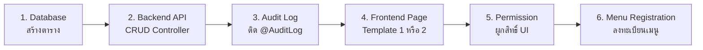

# 🚀 คู่มือคำสั่ง — สร้างเมนูใหม่ครบวงจร (NexOne)

> เอกสารนี้รวบรวม **ตัวอย่างคำสั่ง (Prompt)** สำหรับสร้างเมนูใหม่พร้อมทุกฟีเจอร์  
> ครอบคลุม: Frontend, Backend API, Audit Log, Permission, และ Database

---

## 📑 สารบัญ

1. [ภาพรวมสิ่งที่ต้องทำ](#1-ภาพรวม)
2. [คำสั่งแบบ Template 1 (ตาราง CRUD ธรรมดา)](#2-template-1)
3. [คำสั่งแบบ Template 2 (ตาราง CRUD + Summary Cards)](#3-template-2)
4. [คำสั่งเฉพาะส่วน (แยกทีละชิ้น)](#4-คำสั่งเฉพาะส่วน)
5. [Checklist ก่อนส่งคำสั่ง](#5-checklist)

---

## 1. ภาพรวม

เมื่อสร้างเมนูใหม่ 1 เมนู มีงานทั้งหมด **6 ส่วน**:



| ส่วน | ไฟล์ที่เกี่ยวข้อง | อ้างอิงจาก |
|---|---|---|
| Database | `CREATE TABLE` SQL | ตาราง `nex_core.templates` |
| Backend API | Controller + Service + Module + Entity | `templates.controller.ts` |
| Audit Log | `@AuditLog()` decorator | `roles.controller.ts` |
| Frontend (Type 1) | Page component ใน `components/` | `TemplateMaster1Page.tsx` |
| Frontend (Type 2) | Page component ใน `components/` | `TemplateMaster2Page.tsx` |
| Permission | `usePagePermission()` hook | `PermissionContext.tsx` |
| Menu | INSERT ลง `nex_core.menus` | ตาราง menus |

---

## 2. Template 1 — ตาราง CRUD ธรรมดา

### ลักษณะ:
- ✅ ปุ่ม Export (XLSX/CSV/PDF) ด้านซ้าย
- ✅ ช่องค้นหาด้านขวา
- ✅ ตารางข้อมูลพร้อม Status dropdown
- ✅ ปุ่มจัดการ (ดู/แก้ไข/ลบ)
- ✅ Pagination
- ✅ Modal สำหรับ เพิ่ม/แก้ไข/ดู/ลบ
- ❌ ไม่มี Summary Cards
- ❌ ไม่มีตัวกรองหมวดหมู่

### คำสั่ง:

```
สร้างเมนูใหม่ "[ชื่อเมนู]" ครบทุกส่วน ใช้รูปแบบ Template 1 (ตาราง CRUD ธรรมดา)

📦 ข้อมูลเมนู:
- ชื่อเมนู: [ชื่อเมนู ภาษาอังกฤษ]
- ชื่อตาราง DB: nex_core.[ชื่อตาราง]
- ฟิลด์ข้อมูล: [ระบุ field ที่ต้องการ เช่น name, description, is_active]
- API Path: /[ชื่อ endpoint]

🔧 สิ่งที่ต้องทำ:
1. Backend: สร้าง Entity, Service, Controller, Module ใน nex-core-api
2. Backend: ติด @AuditLog decorator ทุก method
3. Frontend: สร้างหน้า CRUD อ้างอิง TemplateMaster1Page.tsx
4. Frontend: ใช้ usePagePermission('[ชื่อเมนู]') กำหนดสิทธิ์
   - ปุ่ม Export → canExport
   - ช่องค้นหา → canView
   - ปุ่มเพิ่ม → canAdd
   - ปุ่มดู → canView
   - ปุ่มแก้ไข → canEdit
   - ปุ่มลบ → canDelete
   - StatusDropdown → disabled ถ้า !canEdit
5. เพิ่ม Route ใน App.tsx
6. ลงทะเบียนเมนูใน DB (nex_core.menus)
```

### ตัวอย่างจริง:

```
สร้างเมนูใหม่ "Products" ครบทุกส่วน ใช้รูปแบบ Template 1

📦 ข้อมูลเมนู:
- ชื่อเมนู: Products
- ชื่อตาราง DB: nex_core.products
- ฟิลด์ข้อมูล: product_name, product_desc, price, is_active
- API Path: /products

🔧 สิ่งที่ต้องทำ:
1. Backend: สร้าง Entity, Service, Controller, Module ใน nex-core-api
2. Backend: ติด @AuditLog decorator ทุก method
3. Frontend: สร้างหน้า CRUD อ้างอิง TemplateMaster1Page.tsx
4. Frontend: ใช้ usePagePermission('Products') กำหนดสิทธิ์
5. เพิ่ม Route ใน App.tsx
6. ลงทะเบียนเมนูใน DB (nex_core.menus)
```

---

## 3. Template 2 — ตาราง CRUD + Summary Cards + ตัวกรอง

### ลักษณะ:
- ✅ **Summary Cards** ด้านบน (สรุปจำนวนแต่ละหมวดหมู่ + กดกรองได้)
- ✅ ปุ่ม Export (XLSX/CSV/PDF) ด้านซ้าย
- ✅ ช่องค้นหา + ปุ่มเพิ่มข้อมูล ด้านขวา
- ✅ ตารางข้อมูลพร้อม Status dropdown
- ✅ ปุ่มจัดการ (ดู/แก้ไข/ลบ)
- ✅ Pagination
- ✅ Modal สำหรับ เพิ่ม/แก้ไข/ดู/ลบ
- ✅ **Modal เพิ่มหมวดหมู่ใหม่**

### คำสั่ง:

```
สร้างเมนูใหม่ "[ชื่อเมนู]" ครบทุกส่วน ใช้รูปแบบ Template 2 (CRUD + Summary Cards)

📦 ข้อมูลเมนู:
- ชื่อเมนู: [ชื่อเมนู ภาษาอังกฤษ]
- ชื่อตาราง DB: nex_core.[ชื่อตาราง]
- ฟิลด์ข้อมูล: [ระบุ field ที่ต้องการ]
- ฟิลด์จัดกลุ่ม: [field ที่ใช้ทำ Summary Card เช่น category, type, group]
- API Path: /[ชื่อ endpoint]

🔧 สิ่งที่ต้องทำ:
1. Backend: สร้าง Entity, Service, Controller, Module ใน nex-core-api
2. Backend: ติด @AuditLog decorator ทุก method
3. Frontend: สร้างหน้า CRUD อ้างอิง TemplateMaster2Page.tsx
4. Frontend: Summary Cards กรองตาม [ฟิลด์จัดกลุ่ม]
5. Frontend: ใช้ usePagePermission('[ชื่อเมนู]') กำหนดสิทธิ์
   - ปุ่ม Export → canExport
   - ช่องค้นหา → canView
   - ปุ่มเพิ่ม → canAdd
   - ปุ่มดู → canView
   - ปุ่มแก้ไข → canEdit
   - ปุ่มลบ → canDelete
   - StatusDropdown → disabled ถ้า !canEdit
6. เพิ่ม Route ใน App.tsx
7. ลงทะเบียนเมนูใน DB (nex_core.menus)
```

### ตัวอย่างจริง:

```
สร้างเมนูใหม่ "Departments" ครบทุกส่วน ใช้รูปแบบ Template 2

📦 ข้อมูลเมนู:
- ชื่อเมนู: Departments
- ชื่อตาราง DB: nex_core.departments
- ฟิลด์ข้อมูล: dept_name, dept_group, dept_desc, is_active
- ฟิลด์จัดกลุ่ม: dept_group (เช่น ฝ่ายบริหาร, ฝ่ายปฏิบัติ)
- API Path: /departments

🔧 สิ่งที่ต้องทำ:
1. Backend: สร้าง Entity, Service, Controller, Module ใน nex-core-api
2. Backend: ติด @AuditLog decorator ทุก method
3. Frontend: สร้างหน้า CRUD อ้างอิง TemplateMaster2Page.tsx
4. Frontend: Summary Cards กรองตาม dept_group
5. Frontend: ใช้ usePagePermission('Departments') กำหนดสิทธิ์
6. เพิ่ม Route ใน App.tsx
7. ลงทะเบียนเมนูใน DB
```

---

## 4. คำสั่งเฉพาะส่วน (แยกทีละชิ้น)

### 4.1 สร้าง Backend API อย่างเดียว

```
สร้าง CRUD API สำหรับ [ชื่อเมนู] ใน nex-core-api
- ตาราง: nex_core.[ชื่อตาราง]
- ฟิลด์: [รายชื่อ field]
- สร้าง: Entity, Service, Controller, Module
- ติด @AuditLog decorator ทุก method
อ้างอิงจาก templates module
```

### 4.2 สร้าง Frontend อย่างเดียว

```
สร้างหน้า [ชื่อเมนู] แบบ Template [1 หรือ 2]
- เรียก API จาก /[endpoint]
- ผูกสิทธิ์ด้วย usePagePermission('[ชื่อเมนู]')
- ทุกปุ่มผูกกับ permission ตาม pattern เดิม
อ้างอิงจาก TemplateMaster[1 หรือ 2]Page.tsx
```

### 4.3 เพิ่ม Audit Log อย่างเดียว

```
เพิ่ม @AuditLog decorator ให้ [controller] ทุก method
อ้างอิงจาก roles.controller.ts
```

### 4.4 ผูก Permission อย่างเดียว

```
ผูก usePagePermission('[ชื่อเมนู]') ให้หน้า [ชื่อ component]
- Export → canExport
- ค้นหา → canView  
- เพิ่ม → canAdd
- ดู → canView
- แก้ไข → canEdit
- ลบ → canDelete
อ้างอิงจาก TemplateMaster1Page.tsx
```

### 4.5 ลงทะเบียนเมนูใน DB

```
เพิ่มเมนู [ชื่อเมนู] ลงใน nex_core.menus
- app_name: nex-core
- parent: [ชื่อ parent menu หรือ null]
- title: [ชื่อแสดงผล]
- route: /[route path]
- icon: [ชื่อ icon จาก lucide-react]
- sort_order: [ลำดับ]
```

---

## 5. Checklist ก่อนส่งคำสั่ง

ข้อมูลที่ต้องเตรียมก่อนสั่ง:

| # | รายการ | ตัวอย่าง |
|:---:|---|---|
| 1 | ชื่อเมนู (ภาษาอังกฤษ) | `Products`, `Departments` |
| 2 | ชื่อตาราง DB | `nex_core.products` |
| 3 | ฟิลด์ข้อมูลที่ต้องการ | `name, desc, price, is_active` |
| 4 | รูปแบบหน้าจอ (Template 1 หรือ 2) | Template 2 |
| 5 | ฟิลด์จัดกลุ่ม (ถ้าเลือก Template 2) | `category` |
| 6 | Parent menu (อยู่ภายใต้เมนูไหน) | `Master Data` |
| 7 | Icon (จาก lucide-react) | `Package`, `Building` |

> [!TIP]
> ยิ่งระบุข้อมูลครบ ยิ่งได้ผลลัพธ์ตรงตามต้องการ ไม่ต้องแก้ซ้ำ!

---

## ตารางสรุปคำสั่งลัด

| ต้องการ | สั่งว่า |
|---|---|
| สร้างเมนูใหม่ครบทุกส่วน (แบบธรรมดา) | `สร้างเมนูใหม่ "[ชื่อ]" ครบทุกส่วน ใช้รูปแบบ Template 1` |
| สร้างเมนูใหม่ครบทุกส่วน (แบบมี Summary) | `สร้างเมนูใหม่ "[ชื่อ]" ครบทุกส่วน ใช้รูปแบบ Template 2` |
| สร้างเฉพาะ Backend API | `สร้าง CRUD API สำหรับ [ชื่อ] ใน nex-core-api` |
| สร้างเฉพาะ Frontend | `สร้างหน้า [ชื่อ] แบบ Template [1/2]` |
| เพิ่ม Audit Log | `เพิ่ม @AuditLog ให้ [controller] ทุก method` |
| ผูก Permission | `ผูก usePagePermission ให้ [component]` |
| ลงทะเบียนเมนู | `เพิ่มเมนู [ชื่อ] ลงใน nex_core.menus` |

> [!IMPORTANT]
> **คำสั่งสำคัญ:** ระบุ **"อ้างอิงจาก TemplateMaster1Page.tsx"** หรือ **"TemplateMaster2Page.tsx"** เสมอ เพื่อให้ AI ใช้รูปแบบเดียวกันทั้งระบบ
